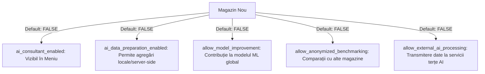
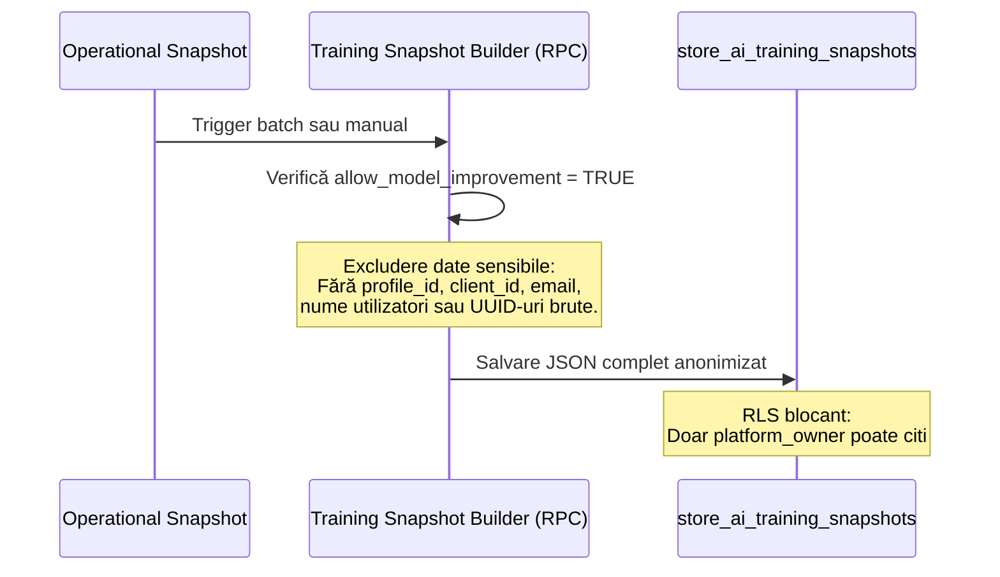

# AI Server-Side Aggregation, Consent & ML Data Contribution Blueprint

Acest document descrie arhitectura tehnică, schema bazei de date, politicile de securitate RLS (Row Level Security) și fluxul de date anonimizate propuse pentru Etapa 6AI.2.

---

## 1. Arhitectura de Consimțământ (Consent Architecture)

Securitatea datelor comerciale și confidențialitatea operațiunilor necesită decuplarea completă a capacităților AI prin **cinci indicatori granulari independenți**. Toate setările au valoarea implicită `FALSE` (opt-in explicit obligatoriu):

- **ai_consultant_enabled**: Permite afișarea link-ului în sidebar și accesarea paginii `/ai-consultant`. Dacă este dezactivat, pagina se încarcă în regim de "Modul Dezactivat".
- **ai_data_preparation_enabled**: Permite citirea datelor din magazin (produse, stocuri, vânzări) și stocarea lor sub formă de cache (snapshot) în baza de date. Fără acesta, serviciul de agregare refuză procesarea.
- **allow_model_improvement**: Permite generarea periodică de dataset-uri agregate pentru a fi exportate în pipeline-ul de training global al platformei.
- **allow_anonymized_benchmarking**: Permite includerea indicatorilor principali ai magazinului în analize comparativ-analitice anonime (e.g. "vânzările magazinului tău comparate cu media magazinelor din regiune").
- **allow_external_ai_processing**: Permite trimiterea contextelor de date către API-uri AI externe (e.g. OpenAI, Anthropic) pentru analiză textuală / generare de recomandări conversaționale.

---

## 2. Schema Bazei de Date (Database Schema)

### A. Tabela: `public.store_ai_consent`
| Nume Coloană | Tip Date | Constrângeri / Valori Implicite | Descriere |
| :--- | :--- | :--- | :--- |
| `store_id` | UUID | PRIMARY KEY REFERENCES `stores(id)` ON DELETE CASCADE | ID-ul magazinului. |
| `ai_consultant_enabled` | BOOLEAN | NOT NULL DEFAULT FALSE | Vizibilitatea modulului în UI. |
| `ai_data_preparation_enabled` | BOOLEAN | NOT NULL DEFAULT FALSE | Permite compilarea datelor magazinului. |
| `allow_model_improvement` | BOOLEAN | NOT NULL DEFAULT FALSE | Opt-in îmbunătățire model ML global. |
| `allow_anonymized_benchmarking`| BOOLEAN | NOT NULL DEFAULT FALSE | Participare la benchmarking-ul anonim. |
| `allow_cross_store_training` | BOOLEAN | NOT NULL DEFAULT FALSE | Permite training încrucișat. |
| `allow_external_ai_processing` | BOOLEAN | NOT NULL DEFAULT FALSE | Permite procesare externă. |
| `consent_version` | TEXT | NOT NULL DEFAULT 'v1' | Versiunea termenilor acceptați. |
| `accepted_by_profile_id` | UUID | REFERENCES `profiles(id)` ON DELETE SET NULL | Administratorul care a acordat permisiunea. |
| `accepted_at` | TIMESTAMPTZ| NULL | Timestamp-ul acceptării. |
| `revoked_at` | TIMESTAMPTZ| NULL | Timestamp-ul retragerii acordului. |
| `created_at` | TIMESTAMPTZ| DEFAULT now() | Data creării înregistrării. |
| `updated_at` | TIMESTAMPTZ| DEFAULT now() | Data ultimei actualizări. |

> [!NOTE]
> **Check Constraint**: `CONSTRAINT chk_model_improvement_consent CHECK (NOT allow_model_improvement OR (accepted_at IS NOT NULL AND accepted_by_profile_id IS NOT NULL))` previne activarea contribution fără semnătură de audit validă.

### B. Tabela: `public.store_ai_snapshots`
| Nume Coloană | Tip Date | Descriere |
| :--- | :--- | :--- |
| `id` | UUID | PRIMARY KEY DEFAULT gen_random_uuid() |
| `store_id` | UUID | REFERENCES `stores(id)` ON DELETE CASCADE |
| `period_days` | INTEGER | Implicit 30 de zile. |
| `generated_at` | TIMESTAMPTZ| Momentul generării datelor agregate. |
| `active_products_count`| INTEGER | Numărul de produse active la acel moment. |
| `total_stock_value` | NUMERIC | Valoarea totală calculată a stocului (achiziție/vânzare). |
| `sales_total` | NUMERIC | Volumul vânzărilor în lei pe ultimele 30 zile. |
| `sales_count` | INTEGER | Numărul total de tranzacții finalizate. |
| `low_stock_count` | INTEGER | Număr produse sub pragul minim (5 bucăți). |
| `no_stock_count` | INTEGER | Număr produse cu stoc zero. |
| `expiry_risk_count` | INTEGER | Număr produse loturi care expiră sub 30 zile. |
| `waste_count` | INTEGER | Număr evenimente de pierderi înregistrate. |
| `snapshot` | JSONB | Structura completă de date pentru componentele dashboard-ului. |
| `recommendations` | JSONB | Recomandările operaționale structurate generate. |
| `created_by` | TEXT | Sursa generării (ex: `system`, `user_trigger`). |
| `created_at` | TIMESTAMPTZ| Data salvării înregistrării. |

---

## 3. Fluxul de Anonimizare & ML Dataset Generation

Generarea datasetului de training respectă cu strictețe principiul **Data Minimization** și **GDPR compliance**:

### Date excluse din ML (Blacklist):
1. Date personale: Nume clienți, emailuri, profile utilizatori.
2. Identificatori direcți: ID-uri interne de utilizator, UUID-uri brute (cu excepția ID-ului de training anonim).
3. Date financiare brute la nivel de tranzacție: Fără bonuri fiscale individuale detaliate, doar indicatori aggregați.

### Date incluse în ML (Whitelist):
1. Rata stocului zero / stocului scăzut în raport cu dimensiunea nomenclatorului.
2. Volume totale de vânzări și număr tranzacții pe perioade temporale (zilnic/săptămânal).
3. Distribuția riscurilor de expirare a loturilor.
4. Rata pierderilor înregistrate.

---

## 4. Semnături RPC Securizate

Fiecare funcție rulează în mod defensiv cu `SECURITY DEFINER` și `SET search_path = public`:

1. **`get_store_ai_consent(p_store_id uuid)`**
   - **Rol**: Citește sau inițializează opțiunile de consimțământ.
   - **Autorizare**: Permis doar pentru manageri/admini sau platform_owner.

2. **`update_store_ai_consent(p_store_id uuid, p_patch jsonb)`**
   - **Rol**: Modifică opțiunile granulare de consimțământ.
   - **Autorizare**: Permis exclusiv utilizatorilor cu rolul `admin` în magazinul respectiv. Actualizează automat `revoked_at` sau `accepted_at` pe baza modificărilor efectuate.

3. **`refresh_store_ai_snapshot(p_store_id uuid, p_period_days integer)`**
   - **Rol**: Rulează interogările analitice pe backend și stochează rezultatul în cache (`store_ai_snapshots`).
   - **Autorizare**: Admini/manageri sau platform_owner. Necesită ca consimțământul `ai_data_preparation_enabled` să fie `TRUE`.

4. **`get_latest_store_ai_snapshot(p_store_id uuid, p_period_days integer)`**
   - **Rol**: Returnează cel mai recent snapshot din cache pentru a fi afișat instant în UI.
   - **Autorizare**: Utilizatorii magazinului autorizați.

5. **`create_training_snapshot_if_consented(p_store_id uuid, p_period_start date, p_period_end date)`**
   - **Rol**: Compilează un dataset de training complet anonimizat din datele istorice operaționale.
   - **Autorizare**: Doar platform_owner. Returnează `NULL` (fără eroare critică) dacă magazinul a dezactivat consimțământul `allow_model_improvement`, prevenind scurgerea de date.
