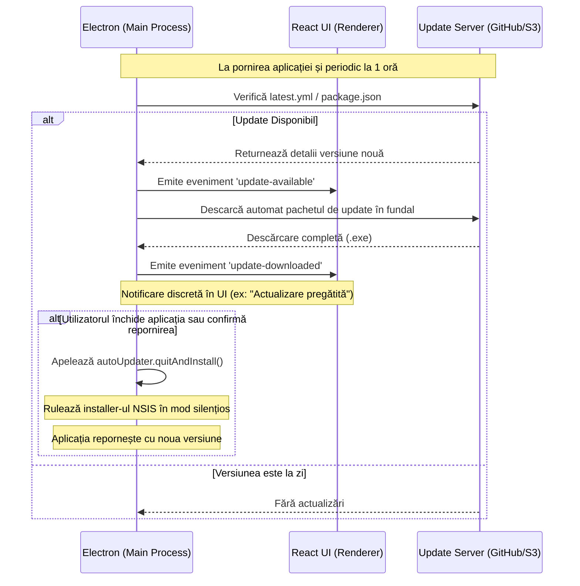

# Desktop Application Auto-Update Blueprint (Etapa 6APP.2)

Acest document descrie strategia și planul de implementare pentru actualizarea automată a aplicației Electron Desktop, facilitând distribuția continuă și transparentă a noilor versiuni direct pe stațiile de lucru (POS) ale clienților.

---

## 1. Obiectiv și Abordare
Fiecare stație POS care rulează versiunea desktop a aplicației trebuie să primească actualizări automate fără intervenția manuală a operatorului. 
* **Target de instalare:** Trecerea de la formatul zip/portabil la **NSIS installer (.exe)** pe platforma Windows.
* **Mecanism de Update:** Utilizarea pachetului `electron-updater` (de la `electron-builder`) conectat la un server de stocare public/privat (ex: GitHub Releases, AWS S3, sau un server static privat).

---

## 2. Arhitectura de Auto-Update



---

## 3. Configurații și Cod Blueprint

### A. Configurare `electron-builder` în `package.json`
Pentru a suporta actualizările automate și instalarea NSIS, configurația din `package.json` va fi actualizată după cum urmează:

```json
{
  "build": {
    "appId": "ro.gestiune.magazin",
    "publish": [
      {
        "provider": "github",
        "owner": "Stefan-Pro",
        "repo": "GestiuneMagazinV.0.01"
      }
    ],
    "win": {
      "target": [
        "nsis"
      ],
      "publish": [
        "github"
      ]
    },
    "nsis": {
      "oneClick": true,
      "allowToChangeInstallationDirectory": false,
      "createDesktopShortcut": true,
      "createStartMenuShortcut": true,
      "shortcutName": "Gestiune Magazin",
      "runAfterFinish": true
    }
  }
}
```

### B. Integrare în Procesul Principal (`electron-main.js`)
În fișierul de startup Electron, se va adăuga logica pentru `electron-updater`:

```javascript
const { app, BrowserWindow, ipcMain } = require('electron');
const { autoUpdater } = require('electron-updater');
const log = require('electron-log');

// Configurare loguri pentru depanarea update-urilor
autoUpdater.logger = log;
autoUpdater.logger.transports.file.level = 'info';
log.info('Aplicația pornește...');

// Dezactivare descărcare automată dacă vrem confirmare explicită
autoUpdater.autoDownload = true;
autoUpdater.autoInstallOnAppQuit = true;

function setupAutoUpdater(mainWindow) {
  // Verifică periodic la fiecare oră
  setInterval(() => {
    autoUpdater.checkForUpdatesAndNotify().catch(err => {
      log.error('Eroare la verificarea periodică:', err);
    });
  }, 60 * 60 * 1000);

  autoUpdater.on('checking-for-update', () => {
    log.info('Se verifică actualizările...');
  });

  autoUpdater.on('update-available', (info) => {
    log.info('Actualizare disponibilă:', info.version);
    mainWindow.webContents.send('update-status', { status: 'available', version: info.version });
  });

  autoUpdater.on('update-not-available', (info) => {
    log.info('Aplicația este la zi.');
  });

  autoUpdater.on('error', (err) => {
    log.error('Eroare updater:', err);
    mainWindow.webContents.send('update-status', { status: 'error', message: err.message });
  });

  autoUpdater.on('download-progress', (progressObj) => {
    let log_message = "Viteză de descărcare: " + progressObj.bytesPerSecond;
    log_message = log_message + ' - Descărcat ' + progressObj.percent + '%';
    log_message = log_message + ' (' + progressObj.transferred + "/" + progressObj.total + ')';
    log.info(log_message);
    mainWindow.webContents.send('update-progress', progressObj.percent);
  });

  autoUpdater.on('update-downloaded', (info) => {
    log.info('Actualizarea a fost descărcată.');
    mainWindow.webContents.send('update-status', { status: 'downloaded', version: info.version });
  });
  
  // IPC Handler pentru repornire și instalare imediată
  ipcMain.handle('install-update-now', () => {
    autoUpdater.quitAndInstall();
  });
}
```

---

## 4. Bune Practici și Reguli de Siguranță
1. **Semnarea Codului (Code Signing):** Instalatoarele Windows (.exe) trebuie semnate digital folosind un certificat de semnătură de cod (EV sau Standard) pentru a evita alertele de tip "Windows SmartScreen blocked this app".
2. **Rollback de Urgență:** În cazul unei versiuni cu defecte majore, se va publica o versiune incrementală nouă (ex: `1.2.4` după `1.2.3`) care anulează bug-urile, updater-ul descărcând-o automat ca fiind cea mai recentă.
3. **Mecanism silențios la POS:** Pentru a nu bloca operatorul POS în mijlocul vânzării, update-ul se descarcă complet în fundal și se instalează doar la repornirea manuală a aplicației sau la închiderea casei.
