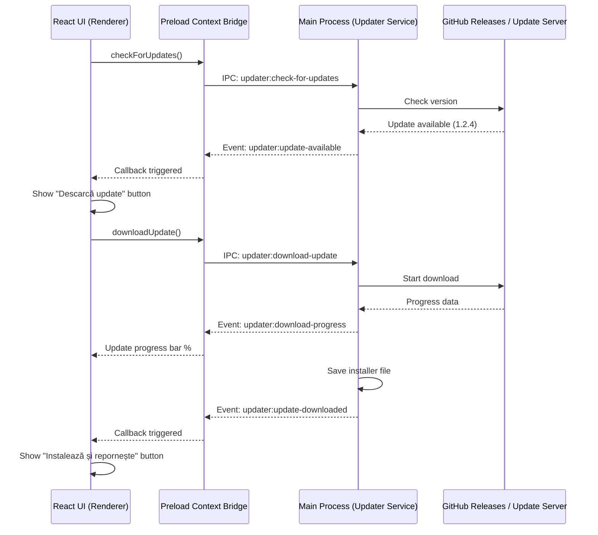

# Desktop Auto-Update Implementation Report - Stage 6APP.2

This document details the architecture, design choices, and verification results for the Electron desktop auto-update system.

## 1. Audit Findings and Build Target Decisions

### Why NSIS instead of Portable for Auto-Updates?
- **Write Permissions and Overwriting:** Portable applications run inside temporary sandboxes or arbitrary user directories. When an update is downloaded, a portable executable cannot easily overwrite itself because it lacks a persistent, structured installer registry and directory structure.
- **NSIS Installer Benefits:** 
  - Standardized installation directory (`C:\Users\<User>\AppData\Local\Programs\...`).
  - Automatic registry key association.
  - Safe, atomic file replacement during restarts.
  - Automatic shortcut creation on desktop and Start Menu.
- **Conclusion:** We modified `package.json` to transition the primary target build to `nsis`, while maintaining the `portable` target as a secondary build option for testing and developer distribution.

---

## 2. Auto-Update Service and IPC Architecture

We decoupled the auto-updater logic from the main application flow into a modular helper: `electron-updater-service.js`.

### Service Components
1. **Background Service:** Configures `autoUpdater` with `autoDownload = false` (preventing unsolicited network consumption).
2. **Startup Check:** Automatically schedules an update check 15 seconds after app startup if packaged.
3. **IPC Channel Guards:**
   - Preload script (`electron-preload.js`) exposes the updater methods inside `window.electronAPI.updater`.
   - Event listeners are locked down via a strictly defined array of channels (`updater:checking-for-update`, `updater:update-available`, `updater:download-progress`, `updater:update-downloaded`, `updater:error`).

### Action Flows

---

## 3. UI Update Center & Safety Guards

The Update Center panel has been integrated directly into the **Store Settings** page (`StoreSettingsPage.tsx`).

### POS Safety Guard Details
To prevent catastrophic data loss (e.g., closing the app while a sale is in progress or a cashier is scanning products), we implemented the following safety guards:
- **POS Cart State Persistence:** The POS cart items are automatically synced to `localStorage` under `pos_cart` whenever modified.
- **Blocking Condition:** Clicking `Instalează și repornește` checks if `localStorage.getItem('pos_cart')` is present and contains items.
- **Action:**
  - If a cart is active, the installation is blocked with: `Finalizează sau golește coșul înainte de instalarea update-ului.`
  - If the cart is empty, a standard confirmation alert is displayed: `Închide aplicația și instalează update-ul? Asigură-te că nu ai vânzări în curs.`

---

## 4. Testing & E2E Validation Results

A dedicated E2E test suite was created (`test_desktop_auto_update_6app2.py`) to validate all scenarios.

### Test Scenarios Covered
1. **Scenario A (Static Config):** Verified `package.json` target configurations, NSIS properties, publish endpoints, and dependencies.
2. **Scenario B & C (UI Updates & Simulations):** Injected Electron IPC mocks in Playwright. Triggered manual update verification, simulated progress updates (e.g., 65%), and checked UI text transitions.
3. **Scenario D (POS Safety Guards):** Validated that update installation succeeds when the cart is empty, but is strictly blocked with the correct alert message when `pos_cart` is populated.
4. **Scenario E (Browser Fallback):** Validated that in a browser context, fallback warning alerts are displayed, and update actions are hidden.

### Execution Summary
- **Suite `test_desktop_auto_update_6app2.py`:** **PASSED** (Exit code 0).
- **Suite `test_nir_placeholder_update_offline_6app1.py`:** **PASSED** (Exit code 0).
- **Suite `test_fiscalnet_pos_auto_write_6gfn3.py`:** **PASSED** (Exit code 0).
- **Compilation Build (`npm run build`):** **PASSED** (Exit code 0).
