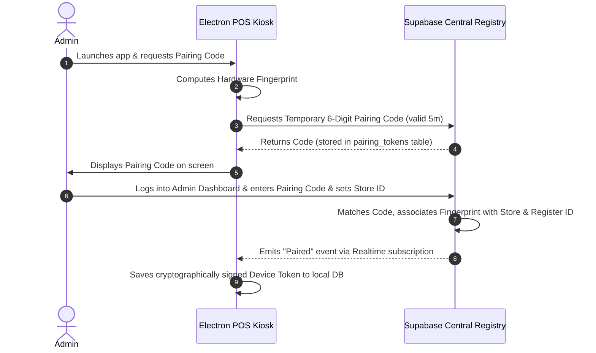

# Blueprint — POS Device Pairing & Anti-Fraud Security (6APP.6.5)

This blueprint documents the hardware device pairing protocol and anti-fraud architecture designed to lock down POS cash register terminals, prevent unauthorized session cloning, and detect offline transaction tampering.

---

## 1. Hardware Fingerprinting & Pairing Registry

To ensure that POS transactions are executed exclusively on authorized physical hardware terminals, each POS installation is bound to the store's central registry through a cryptographic device fingerprint.

### Fingerprint Formulation
The local Electron main process generates a unique, stable device hardware profile (`device_fingerprint`) by concatenating low-level system attributes:
```
SHA-256 (
  CPU ID + 
  Motherboard UUID + 
  Primary Network MAC Address + 
  OS Installation Date
)
```

### Pairing Handshake Flow



---

## 2. Cryptographic Security & Anti-Tampering

Once paired, every local transaction payload is secured to ensure integrity and authenticity.

### Payload Hashing & Signatures
Before a local transaction is queued in the SQLite table (`local_offline_sales_queue`), the app creates a cryptographic HMAC-SHA256 signature:
1. **Payload serialization**: The entire transaction payload (totals, SGR items, timestamps, register details) is normalized and serialized into a canonical JSON string.
2. **Signature computation**: The signature is generated using a secure, local hardware-derived key:
   $$\text{HMAC} = \text{HMAC-SHA256}(\text{Canonical JSON Payload}, \text{Device Private Key})$$
3. **Database insertion**: Both the transaction payload and the HMAC signature are written to SQLite.

### Replay & Tamper Detection
During central synchronization, the Supabase remote API:
- Re-calculates the HMAC signature using the registered device's public key.
- Verifies that the `created_at_local` timestamp falls within valid chronological bounds (preventing replay attacks).
- If signature mismatch or timestamp duplication is detected, the transaction is marked as `failed_tampered`, quarantined, and triggers an admin alert.

---

## 3. Physical Security Checklist for Stores

For high-security operations, the following retail operational practices are recommended:

1. **Hardware Integrity Seals**: Periodically inspect physical tamper-evident stickers covering USB/diagnostic ports on the terminal.
2. **Kiosk Mode Enforcement**: The cashier account must be restricted under Kiosk Mode at the OS level (e.g., Windows Assigned Access / Shell Launcher) preventing task manager access or shortcut bypasses.
3. **Network Isolation**: POS terminals must operate on a dedicated VLAN with strict firewalls restricting all external web traffic except Supabase endpoint ports.
4. **Barcode Reader Lock**: Barcode readers must be locked in "USB keyboard emulation" mode with specific preamble characters to prevent external console injection.
