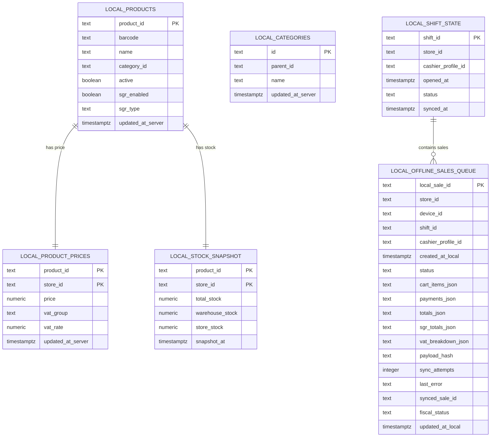

# Technical Blueprint: Offline POS Data Cache & Sales Queue (Stage 6APP.3)

> [!IMPORTANT]
> This document acts as an architectural specification blueprint. The actual offline sales queues, SQLite engine, and offline checkouts are NOT implemented in the current stage. The proposed SQL blueprint is NOT applied live to the database.


---

## 1. Local Database Strategy (SQLite)

For local desktop client storage, **SQLite** running in the Electron Main process (accessed via IPC context bridges) is chosen over browser-based options (`localStorage` or `IndexedDB`) due to:
- **Crash Safety:** SQLite features ACID transactions, ensuring that data is never corrupted during sudden power cuts or client OS freezes.
- **Backup Simplicity:** The database is represented by a single file on disk, which makes copying, backing up, or exporting extremely simple.
- **Performance:** Native indexing supports lightning-fast local barcode and product searches.
- **Relational Integrity:** Restricts transactions to validated shifts and profiles.

### Local SQLite Schema Specifications



---

## 2. Synchronization Schedule & Cache Validity

To prevent stale prices and invalid stock snapshots, a strict synchronization regime is defined:

```
[App Startup] ──> check connectivity ──(Online)──> Incremental Sync
                                     └──(Offline)──> Verify Cache (Age < 48h) ──> Allow POS Offline
```

### Sync Frequency
1. **Startup Check:** The application checks connectivity. If online, it pulls incremental updates. If offline and a valid cache is present, it transitions to Offline Mode.
2. **Login Hook:** Fetches active store configuration, employee roles, and active shifts.
3. **Periodic (Incremental):** Every **15 to 30 minutes** while online, an incremental pull updates updated entries via `get_offline_cache_bundle(...)`.
4. **Daily Full Refresh:** Executed once at the start of the retail day. Triggers a full rebuild of product catalogs.
5. **Manual Refresh:** Admin can click "Actualizează date offline" to force synchronization.

### Cache Expiration Rules
- **Age < 24 Hours:** Normal operation.
- **Age 24 - 48 Hours:** warning banner appears: `Datele cache-ului sunt mai vechi de 24h. Recomandăm conectarea la rețea.` POS continues to operate.
- **Age > 48 Hours:** POS is strictly **blocked** from offline checkouts until an online connection updates the local database.

---

## 3. Local Backup & Recovery Protocol (Hardware Protection)

If a POS terminal experiences physical hardware failure (e.g. power supply failure, corrupted OS drive) *before* the local queue is synchronized to the server, data must be recoverable.

### Backup Strategy
1. **Append-Only JSONL Logs:** Every time a sale is checked out offline, the Electron Main process appends the raw transaction payload to a daily backup file:
   `%APPDATA%\GestiuneMagazin\offline-backups\offline-sales-backup-YYYY-MM-DD.jsonl`
2. **Checksum Integrity:** Each JSONL line contains:
   ```json
   {"local_sale_id": "uuid", "payload": {...}, "payload_hash": "sha256", "created_at": "timestamp", "device_id": "uuid"}
   ```
3. **Rotation:** Daily backups are retained locally for **30 days**.
4. **External Paths:** Administrators can configure secondary backup destinations (e.g., an external USB drive or a local NAS directory).

### UI System Recovery Tools
Under system settings, administrators gain access to:
- **Exportă coada offline:** Exports current unsynced sales as an encrypted package.
- **Importă coadă offline:** Imports external backup packages to recover sales from damaged sister terminals.
- **Verifică integritate backup:** Scan local `.jsonl` files to audit hashes and detect corruptions.

---

## 4. Offline POS UI/UX Behavior

When the network hook detects disconnection:
1. **Banner Warning:** The POS displays a persistent yellow status bar: `Mod offline — prețurile și stocurile sunt din ultima sincronizare.`
2. **Catalog Rules:** Scanning and searching is limited to cached products. Unregistered or unknown items are rejected.
3. **Checkout Button:** Changes from `ÎNCASEAZĂ` to `Salvează vânzare offline`.
4. **Confirmation Alert:** Displays: `Aplicația este offline. Bonul fiscal va fi emis automat la restabilirea conexiunii și sincronizare.`
5. **Queue Transition:** Upon approval, the sale is hashed, written to SQLite in `queued` status, appended to the JSONL log, and the cart is cleared.

---

## 5. Post-Sync FiscalNet Policy

To prevent compliance errors or double receipt printing:
- **No Offline Writes:** The local POS terminal does **NOT** write to the FiscalNet folder while offline.
- **Sync First:** FiscalNet operations are triggered only after:
  1. The sale is successfully pushed to the server via `sync_offline_sale(...)`.
  2. The server processes, validates, and responds with a confirmed `sale_id`.
  3. The local client generates the Caret-separated file and writes it to the designated FiscalNet folder.

---

## 6. Device Identity

Each terminal has a unique ID to manage logs and coordinate sync states:
- **Fingerprinting:** A non-invasive UUID is generated upon initial startup and written to `%APPDATA%\GestiuneMagazin\device_id.json`.
- **Registry:** During initial configuration, the administrator registers the terminal name (e.g., `POS-01-CaleaVictoriei`) via `register_pos_device(...)`.
- **Diagnostic Panel:** Displays Device ID, active status, last sync timestamp, and pending queue size.

---

## 7. Conflict Resolution & Security

### Conflict Types during Sync
- **`synced`**: Success.
- **`duplicate`**: The payload was already written (handled via idempotency constraints on `device_id` + `local_sale_id`).
- **`conflict_price` / `conflict_vat`**: Local pricing did not match active server rates. The sale is flagged as `conflict` and held for administrator review.
- **`shift_closed`**: The shift associated with the local sale was closed on the server. Held in status `conflict`.

### Security Hardening
- **Payload Verification:** The client generates a SHA-256 hash of the transaction before writing. The server recalculates and rejects mismatching packages.
- **Server Recalculations:** The server does not trust client arithmetic; it recalculates VAT, SGR fees, and line totals from the item quantities and active catalog prices.

---

## 8. SQL Schema Hardening (Stage 6APP.4 Updates)

Prior to database application, the SQL schema has been reinforced with strict database-level constraints:
- **Identifier Lengths:** `pos_devices.device_fingerprint` must be at least 12 characters. `pos_devices.device_name` must be at least 2 characters.
- **Transaction Idempotency:** Managed via unique constraint `unique_store_device_sale` on `(store_id, device_id, local_sale_id)`.
- **Whitelists:** Status and Entity constraints are strictly enforced using whitelist checks (`status IN ('received', 'finalized', 'duplicate', 'conflict', 'failed', 'rejected')` and `entity IN ('products', 'product_prices', 'stock_batches', 'categories', 'shifts', 'store_settings', 'fiscalnet_config', 'full_bundle')`).
- **Cryptographic Hash Checks:** SHA-256 validation enforced on `payload_hash` and snapshots `checksum` via regex matching `~ '^[a-f0-9]{64}$'`.
- **Audit Integration:** All registration, sync request, and finalization actions write to the central `public.audit_logs`.
- **Privilege Lockdown:** Execution permissions for all new RPC functions are explicitly revoked from `PUBLIC` and `anon` users, granting execution privileges exclusively to `authenticated` users, backed by internal RBAC checks.

