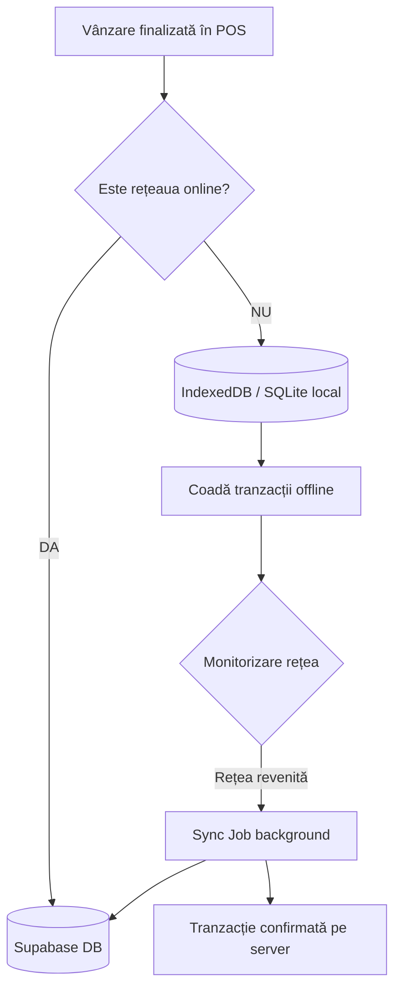

# Offline Safe Mode and Recovery Blueprint (Etapa 6APP.3)

Acest document descrie arhitectura tehnică pentru starea offline (Safe Mode) în aplicația POS, detaliind comportamentul actual de blocare selectivă a acțiunilor critice și planul de dezvoltare pentru vânzările offline complete cu sincronizare ulterioară.

---

## 1. Arhitectura Stărilor de Rețea
Aplicația monitorizează conectivitatea folosind API-ul browserului (`navigator.onLine` / evenimentele `online` și `offline`), adăugând o stare intermediară de debouncing pentru stabilizare rețea (`reconnecting`).

```
                +-------------------------+
                |         ONLINE          | <---+
                +-------------------------+     |
                  |                             | Eveniment 'online'
                  | Eveniment 'offline'         | (după 2000ms delay)
                  v                             |
                +-------------------------+     |
                |         OFFLINE         | ----+
                |      (Safe Mode UI)     |
                +-------------------------+
```

---

## 2. Comportament Curent în Safe Mode (Etapa 6APP.1)

Când aplicația intră în modul **Offline / Safe Mode**, se activează automat o serie de restricții de siguranță pentru a preveni desincronizarea datelor din baza de date centrală Supabase și a asigura integritatea casei de marcat:

| Modul / Ecran | Acțiune | Comportament Offline | Mesaj / Alertă |
| :--- | :--- | :--- | :--- |
| **Global** | - | Afișare banner roșu fix în top. Ascunde indicatorul verde "Online". | `Offline — unele funcții sunt indisponibile` |
| **POS** | Finalizare Vânzare | Dezactivează butonul `ÎNCASEAZĂ`. Oprește execuția funcției `finalizeSale` înainte de apelurile API și scrierea bonului fiscal. | `Sistem offline. Vânzarea nu poate fi finalizată până la reconectare.` |
| **Produse** | Modificare / Ștergere | Blochează apelurile către database. Afișează banner galben și badge animat `Date posibil neactualizate`. | `Nu poți modifica produse cât timp aplicația este offline.` |
| **Recepție** | Trimitere Recepție | Blochează apelul `submitReception` și stornarea datelor. | `Nu poți finaliza recepții cât timp aplicația este offline.` |
| **Setări** | Salvare Modificări | Dezactivează salvarea setărilor în Supabase. Afișează banner roșu de alertă. | `Nu poți salva modificări cât timp aplicația este offline.` |
| **AI Consultant** | Reîmprospătare Analiză | Blochează trimiterea datelor către modelul LLM extern. | `Analiza AI nu poate fi reîmprospătată fără conexiune.` |

---

## 3. Planul pentru Modul Offline Complet (Viitor - Etapa 7)
Pentru a permite operarea 100% offline în magazin (vânzare continuă chiar și fără internet), se va dezvolta un mecanism hibrid bazat pe baza de date locală (SQLite sau IndexedDB) și o coadă de sincronizare.



### Componente Viitoare:
1. **Catalog Cache local:** Stocarea catalogului complet de produse (cod de bare, preț, stoc curent) în browser (`IndexedDB` sau `localStorage`). POS-ul va citi direct din cache-ul local pentru căutări și scanare de coduri de bare, fără a depinde de conexiuni remote în timpul vânzării.
2. **Coadă Tranzacțională locală (Offline Queue):** Când operatorul finalizează o vânzare în timp ce este offline:
   - Tranzacția se salvează local cu un ID unic temporar și timestamp.
   - Stocul local este decrementat imediat în memorie.
   - Bonul fiscal se emite la nivel local prin FiscalNet (folosind datele tranzacției locale).
3. **Background Synchronizer:** Un worker de fundal care monitorizează starea rețelei. La revenirea online:
   - Trimite tranzacțiile offline salvate, una câte una, în ordinea cronologică (FIFO).
   - Rezolvă eventualele conflicte de stoc direct pe server.
   - Actualizează catalogul cache local cu noile date din server.
