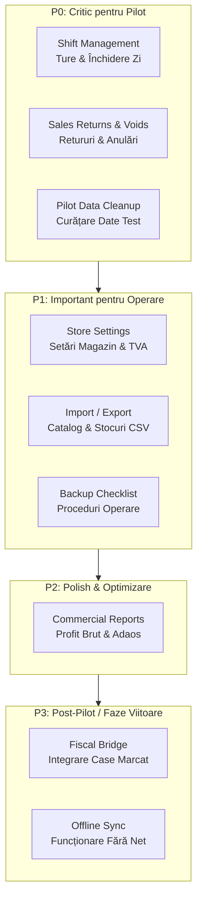
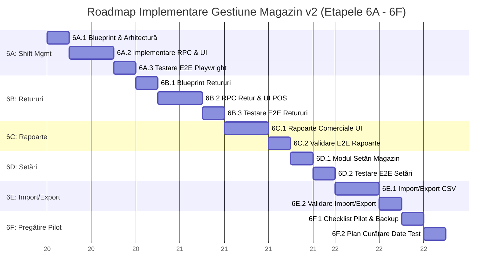

# Operational Management Audit — Etapa 6A.0

## 1. Rezumat Executiv

Prezentul raport reprezintă un audit operațional complet al platformei **Gestiune Magazin v2**, realizat la finalul etapei de consolidare a consolei proprietarului (Etapele 5E). Obiectivul principal al acestui audit este evaluarea maturității funcționale a aplicației de gestiune și identificarea gap-urilor operaționale, comerciale și de trasabilitate care trebuie rezolvate înainte de implementarea platformei într-un magazin pilot real (în regim controlat).

### Ce este deja solid (Core Transactional & Administrative Backbone)
Platforma beneficiază în prezent de o arhitectură tranzacțională și administrativă extrem de robustă, validată riguros prin teste E2E automate (Playwright):
1. **Tranzacții Atomice Securizate (Supabase RPCs)**: Toate operațiunile critice de mișcare a stocurilor sunt încapsulate în funcții stocate atomice (`finalize_sale`, `receive_stock`, `transfer_stock`, `record_waste`), eliminând complet riscul de tranzacții parțiale, concurență neloială sau stocuri negative.
2. **Securitate și Izolare RLS**: Tabela de profile și relațiile de apartenență la magazin (`store_members`) sunt protejate prin Row Level Security (RLS). Nu se utilizează `service_role` în frontend.
3. **Owner Console v2 & Context Switching**: `platform_owner`-ul poate gestiona centralizat magazinele (diferențiate prin CUI și punct de lucru), utilizatorii și alocările acestora. Utilizatorii multi-store pot comuta fluid contextul de lucru prin `StoreContextSwitcher`, având starea sincronizată și izolată corect.
4. **Owner Audit Logs**: Toate acțiunile administrative majore sunt auditate asincron și non-blocking în `public.audit_logs`, oferind vizibilitate completă asupra modificărilor de stare (`oldData` vs `newData`).

### Ce lipsește înainte de pilot (Operational & Commercial Gaps)
Deși nucleul de înregistrare a mișcărilor de stoc este stabil, pentru operarea zilnică într-un magazin real sunt indispensabile următoarele module operaționale:
* **Gestiunea Turelor (Shift Management)**: Controlul fluxului de numerar din sertar, deschiderea și închiderea zilei de lucru de către casieri.
* **Retururi și Anulări (Sales Returns & Voids)**: Corectarea erorilor de operare pe POS și procesarea retururilor de marfă cu repunere în stoc.
* **Rapoarte Comerciale Avansate**: Vizibilitatea asupra profitabilității brute (adaos comercial, marjă, top produse) și stocurilor blocate.
* **Setări Magazin (Store Settings)**: Parametrizarea cotelor TVA, pragurilor de alertă stoc și a datelor de identificare fiscală.
* **Import / Export Catalog și Stocuri**: Inițializarea rapidă a mii de produse din fișiere CSV/Excel și exportul datelor pentru contabilitate.
* **Proceduri de Curățare și Pregătire Pilot**: Separarea datelor de test de datele reale și proceduri clare de backup înainte de go-live.

---

## 2. Module existente

Tabelul de mai jos sintetizează stadiul actual al modulelor operaționale și administrative din cadrul aplicației de gestiune:

| Modul | Status | Validare E2E | Observații | Risc Operațional |
| :--- | :--- | :--- | :--- | :--- |
| **POS** (`src/features/pos`) | Solid (RPC Atomic) | **PASS** (5D.5.1, 5D.6) | Operează prin `finalize_sale`. Descarcă stoc FIFO, înregistrează vânzări, itemi și plăți. | **Ridicat**: Lipsesc turele de casieri. Numerarul se cumulează continuu, neputând fi reconciliat la final de zi. Nu există flux de anulare/retur. |
| **Istoric Vânzări** (`src/features/sales-history`) | Funcțional | **PASS** (Indirect) | Afișează bonuri, detalii itemi și metode de plată. Filtrare pe date. | **Mediu**: Lipsă filtrare pe ture de casieri și lipsă buton direct de stornare/retur. Nu are export CSV. |
| **Recepție** (`src/features/reception`) | Solid (RPC Atomic) | **PASS** (5D.4.1, 5D.6) | Operează prin `receive_stock`. Creează produse, loturi, prețuri și NIR. | **Mediu**: Nu există mecanism de stornare NIR în caz de eroare umană. Lipsește tipărirea NIR-ului în format contabil. |
| **Transferuri** (`src/features/transfers`) | Solid (RPC Atomic) | **PASS** (5D.2.1, 5D.6) | Operează prin `transfer_stock`. Mișcă stoc între loturi și creează mișcări stoc. | **Mediu**: Transferul se face instantaneu. Lipsește fluxul de confirmare/primire la destinație și tipărirea Avizului de Însoțire. |
| **Pierderi / Casări** (`src/features/losses`) | Solid (RPC Atomic) | **PASS** (5D.3.1, 5D.6) | Operează prin `record_waste`. Descarcă stoc și înregistrează evenimente de pierdere. | **Scăzut**: Lipsește tipărirea Procesului-Verbal de Casare necesar pentru justificări fiscale. |
| **Istoric Pierderi** (`src/features/loss-history`) | Funcțional | **PASS** (5D.3.1) | Afișează istoricul casărilor pe motive și cantități. | **Scăzut**: Lipsește exportul datelor în format CSV/Excel pentru contabilitate. |
| **Produse / Stocuri** (`src/features/products`) | Funcțional | **PASS** (Core flows) | Catalog produse, stocuri agregate, vizualizare loturi și prețuri. | **Ridicat**: Lipsește importul masiv din CSV pentru inițializarea magazinului și modulul de inventariere faptică (reglare diferențe). |
| **Dashboard** (`src/features/dashboard`) | Funcțional | **PASS** (Vizual) | Indicatori de bază: vânzări totale, tranzacții, alerte stoc și expirări. | **Mediu**: Lipsesc rapoartele de profitabilitate (adaos, profit brut estimat, rotația stocurilor). |
| **Expirări** (`src/features/expirations`) | Funcțional | **PASS** (Vizual) | Monitorizare și alertare loturi cu termen scurt sau expirate. | **Scăzut**: Ar beneficia de acțiuni rapide de discount/promoție direct din panoul de alerte. |
| **AI Consultant** (`src/features/ai-consultant`) | Solid (Determinist) | **PASS** (Funcțional) | Oferă recomandări bazate pe reguli stricte (reaprovizionare, discount, casare). | **Scăzut**: Instrument excelent de suport decizional. Necesită corelare viitoare cu rapoartele comerciale. |
| **Owner Console** (`src/features/owner-console`) | Solid (Complet) | **PASS** (5E.3.1 - 5E.5.1)| Gestiune magazine, alocare membri, comutator context și audit logs complet. | **Scăzut**: Necesită extindere cu setări specifice per magazin (TVA, praguri stoc, date fiscale). |
| **Auth** (`src/features/auth`) | Solid (Supabase) | **PASS** (Toate) | Autentificare, integrare RLS, injectare context magazin activ. | **Mediu**: Crearea de noi utilizatori depinde de aplicarea manuală a blueprint-ului de curățare a trigger-ului legacy. |

---

## 3. Gap-uri operaționale

Pentru a asigura succesul unui pilot real într-un magazin, au fost identificate 7 zone majore de gap operațional (A - G):

### A. Ture casieri / Închidere zi (Shift Management)
În retailul fizic, activitatea POS este strict segmentată pe ture de lucru pentru a asigura trasabilitatea numerarului din sertar.
* **Deschidere tură**: Casierul declară suma existentă în sertar (cash inițial / fond de rulment). POS-ul trebuie blocat dacă nu există o tură activă deschisă de utilizatorul curent.
* **Înregistrare tranzacții**: Toate vânzările (cash, card, mixt) se asociază automat cu ID-ul turei active.
* **Închidere tură (Z-Report intern)**: La finalul programului, casierul numără banii din sertar și introduce totalul faptic. Sistemul calculează diferența de casă (plus/minus faptic vs scriptic) și generează raportul de tură.

### B. Retur / Anulare vânzare (Sales Returns & Voids)
Erorile de marcare pe POS sau decizia clientului de a returna un produs sunt inevitabile.
* **Anulare bon (Void)**: Anularea completă a unei tranzacții recente, cu stornarea integrală a plăților și repunerea stocului în loturile de origine.
* **Retur parțial (Return)**: Returnarea unuia sau mai multor itemi de pe un bon, calculul sumei de restituit (cash/card) și ajustarea stocului.
* **Audit și Trasabilitate**: Orice retur sau anulare trebuie să fie strict auditată pentru a preveni fraudele interne (sustragerea de numerar din sertar justificată prin retururi false).

### C. Rapoarte Comerciale Avansate (Commercial Reports)
Managementul magazinului are nevoie de instrumente de analiză financiară pentru a lua decizii de achiziție și stabilire a prețurilor.
* **Profit Brut Estimat**: Calculat ca diferență între valoarea vânzărilor și costul mărfii vândute (COGS), utilizând prețul de achiziție din loturile descărcate (FIFO).
* **Adaos Comercial Mediu**: Urmărirea marjei de profit pe categorii și per total magazin.
* **Top Produse & Viteza de Rotație**: Identificarea produselor cu rulaj mare (bestsellers) și a stocurilor blocate (produse nevândute de peste 30/60/90 zile).
* **Analiză Plăți**: Ponderea încasărilor numerar vs card bancar.

### D. Setări Magazin (Store Settings)
Fiecare punct de lucru are particularități fiscale și operaționale care trebuie configurabile din interfață, eliminând valorile hardcodate.
* **Cote TVA Implicite**: Definirea cotelor standard de TVA (ex. 19%, 9%, 8%) aplicabile la crearea produselor și recepții.
* **Praguri de Alertă Stoc**: Personalizarea nivelului de stoc minim la care se declanșează alertele de reaprovizionare.
* **Date Fiscale Firmă**: Nume firmă, CUI, Nr. Reg. Com., adresă punct de lucru, necesare pentru tipărirea viitoare a bonurilor și facturilor.
* **Metode de Plată Active**: Activarea/dezactivarea plății cu cardul sau a altor metode alternative.

### E. Import / Export (Catalog & Stocuri)
Inițializarea manuală a catalogului de produse la deschiderea unui magazin nou constituie un blocaj operațional major.
* **Import CSV/Excel**: Modul robust de import pentru produse, prețuri și stocuri inițiale, cu validare client-side a capului de tabel și a tipurilor de date.
* **Export Date**: Posibilitatea de a exporta stocul curent, istoricul de vânzări și rapoartele de tură în format CSV/Excel pentru transmitere către departamentul de contabilitate.

### F. Curățare Date Test & Seed Strategy (Pilot Data Preparation)
Pe parcursul dezvoltării și testării E2E s-au generat numeroase date de test (magazine fictive, tranzacții simulate, audit logs de test).
* **Separare și Curățare**: Elaborarea unui plan clar de eliminare a datelor de test din baza de date de producție înainte de lansarea pilotului, fără a afecta structura tabelelor sau conturile reale de administrare.
* **Seed Strategy**: Procedură standardizată de populare a catalogului inițial pentru magazinul pilot.

### G. Backup & Operare (Operational Runbook)
Securitatea datelor și continuitatea afacerii în magazinul pilot necesită proceduri clare de operare.
* **Checklist Backup Supabase**: Verificarea și planificarea backup-urilor automate (Point-in-Time Recovery sau exporturi periodice).
* **Gestiune Conturi și Parole**: Stabilirea clară a rolurilor pentru personalul din magazinul pilot (manager magazin, casieri) și securizarea conturilor.

---

## 4. Prioritizare

Pentru a optimiza efortul de dezvoltare și a asigura o lansare pilot rapidă și sigură, modulele lipsă au fost clasificate în 4 niveluri de prioritate:

### P0: Critic pentru Pilot (Must-Have Absolute)
Fără aceste module, magazinul nu poate deschide ușile pentru clienți din motive de securitate a numerarului, trasabilitate și conformitate de bază:
1. **Shift Management (Ture Casieri & Închidere Zi)**: Indispensabil pentru gestiunea sertarului de bani și predarea turei.
2. **Sales Returns & Voids (Retur / Anulare Bon)**: Indispensabil pentru corectarea greșelilor inerente ale casierilor la marcare.
3. **Pilot Data Cleanup Plan**: Indispensabil pentru a porni pe o bază de date curată, fără tranzacții sau stocuri fantomă din fazele de test.

### P1: Important pentru Operare (High Priority)
Aceste module reduc drastic timpul de operare și asigură parametrizarea corectă a gestiunii:
1. **Store Settings (Setări Magazin)**: Necesare pentru cote TVA corecte și date de antet pe documente.
2. **Import / Export Catalog (CSV/Excel)**: Necesar pentru încărcarea inițială a stocului magazinului pilot în câteva minute, în loc de zile de muncă manuală.
3. **Backup & Operational Checklist**: Necesar pentru siguranța datelor.

### P2: Polish & Optimizare (Medium Priority)
1. **Commercial Reports (Profit Brut & Adaos)**: Extrem de valoroase pentru manager, dar pot fi lansate la câteva zile după deschiderea pilotului, pe măsură ce se acumulează date reale de vânzări.

### P3: Post-Pilot / Faze Viitoare (Out of Scope for Stage 6)
1. **Fiscal Bridge**: Conectarea hardware la case de marcat fiscale (va face obiectul unei etape arhitecturale separate, post-pilot).
2. **Offline Sync**: Păstrarea funcționalității POS în lipsa conexiunii la internet cu sincronizare ulterioară (arhitectură avansată de tip local-first, planificată post-pilot).

---

## 5. Roadmap 6A - 6F

Pe baza prioritizării de mai sus, propunem următorul roadmap de implementare, structurat logic și secvențial:

### Detalierea Sub-Etapelor

#### Etapa 6A: Shift Management (Ture Casieri & Închidere Zi) — P0
* **6A.1 — Shift Management Blueprint**: Arhitectura tabelelor/funcțiilor necesare pentru ture (`cash_registers`, `pos_shifts`), definirea stărilor (`open`, `closed`) și a regulilor de validare.
* **6A.2 — Shift Management Implementation**: Crearea procedurilor stocate de deschidere/închidere tură și integrarea UI în modulul POS (sertar de bani, declarare numerar, raport Z intern).
* **6A.3 — Shift E2E Test**: Validare automată Playwright pentru fluxul complet de deschidere tură, marcare vânzări pe tură, declarare numerar și închidere tură.

#### Etapa 6B: Sales Returns & Cancellation (Retururi & Anulări) — P0
* **6B.1 — Sales Returns/Cancellation Blueprint**: Arhitectura tranzacțională pentru stornare (anulare bon complet vs retur parțial de itemi), repunere în stoc FIFO/LIFO pe loturi și ajustare plăți.
* **6B.2 — Returns RPC + UI**: Implementarea RPC-ului atomic `process_return` și crearea interfeței de retur în POS și Istoric Vânzări.
* **6B.3 — Returns E2E Test**: Validare automată Playwright pentru anularea unui bon și returul parțial cu verificarea repunerii stocului în `stock_batches`.

#### Etapa 6C: Commercial Reports Upgrade (Rapoarte Comerciale) — P2
* **6C.1 — Commercial Reports Upgrade**: Extinderea dashboard-ului cu rapoarte avansate de profitabilitate brută estimată (vânzări minus COGS), top produse, adaos mediu și stoc blocat.
* **6C.2 — Reports E2E/Validation**: Validarea acurateței calculelor financiare și a filtrelor prin teste automate.

#### Etapa 6D: Store Settings Module (Setări Magazin) — P1
* **6D.1 — Store Settings Module**: Crearea panoului de configurare per magazin (cote TVA, prag stoc minim, date fiscale de antet, metode de plată active).
* **6D.2 — Settings E2E Test**: Validarea persistenței setărilor și a reflectării lor în formularele de recepție și POS.

#### Etapa 6E: Import / Export Products & Stock — P1
* **6E.1 — Import/Export Products & Stock**: Implementarea utilitarului de import masiv CSV/Excel pentru catalog și stocuri inițiale, alături de exportul rapoartelor și mișcărilor.
* **6E.2 — Import/Export Validation**: Verificarea E2E a importului unui fișier CSV de test, validarea erorilor de format și confirmarea creării produselor.

#### Etapa 6F: Pilot Store Preparation & Cleanup — P0
* **6F.1 — Pilot Store Checklist**: Elaborarea ghidului operațional de lansare, verificarea politicilor RLS, configurarea conturilor reale de personal și checklist-ul de backup Supabase.
* **6F.2 — Pilot Data Cleanup Plan**: Elaborarea și documentarea scripturilor sigure de curățare a datelor de test (tranzacții, recepții, audit logs fictive) pentru inițializarea curată a bazei de date de producție.

---

## 6. Decizie și Următorul Pas Recomandat

Pe baza analizei de risc operațional și a prioritizării absolute (P0), decizia strategică pentru continuarea proiectului este demararea imediată a **Etapei 6A: Shift Management**.

### Următorul Pas Recomandat: Etapa 6A.1 — Shift Management Blueprint

#### Justificare
Gestiunea turelor de casieri și a numerarului din sertar reprezintă cel mai critic blocaj operațional actual. Fără un mecanism clar de deschidere a turei cu un sold inițial de casă și închidere a turei cu declararea încasărilor faptice, nicio tranzacție POS nu poate fi auditată financiar în mod corect la sfârșitul zilei. Implementarea acestui modul va asigura fundația pe care se vor sprijini ulterior retururile (Etapa 6B) și rapoartele comerciale (Etapa 6C).

#### Obiectivele Etapei 6A.1
1. Proiectarea modelului de date pentru gestiunea turelor (`pos_shifts`).
2. Definirea contractelor stricte pentru procedurile stocate de deschidere tură (`open_pos_shift`) și închidere tură (`close_pos_shift` cu calculul diferențelor de casă).
3. Stabilirea mecanismului de blocare a interfeței POS în lipsa unei ture active.
4. Redactarea blueprint-ului tehnic detaliat (`docs/shift_management_blueprint_6a1.md`) pentru validare arhitecturală.
