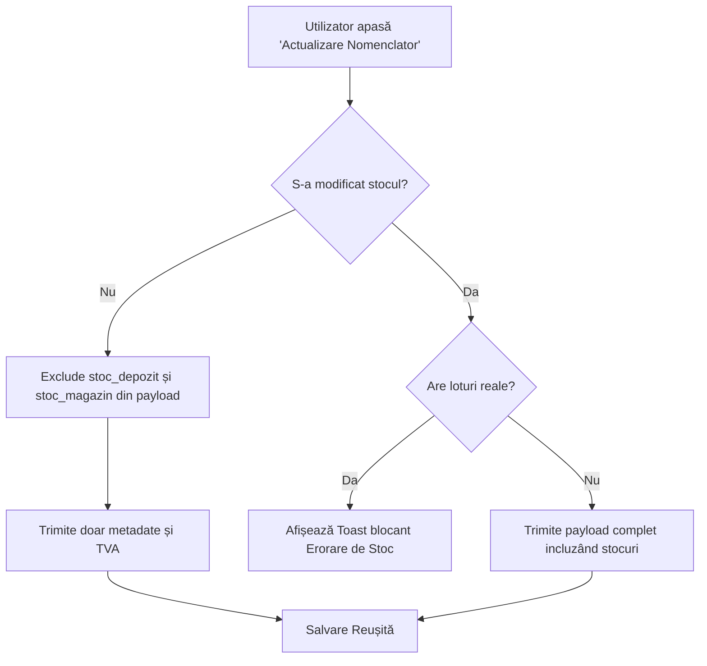

# Raport Hotfix Salvare TVA în Editare Produs cu Loturi (Etapa 6D.5.1 / 6D.5.1.1)

Acest document descrie detaliile tehnice ale remedierii rapide (hotfix) realizate în etapele 6D.5.1 și 6D.5.1.1 pentru a permite modificarea cotei TVA și a metadatelor produselor gestionate pe loturi reale, blocând în același timp strict orice încercare de modificare a stocului direct din Produse.

---

## 1. Problema Identificată (Root Cause)

În mod implicit, modalul de editare al unui produs (`ProductEditModal.tsx`) trimitea întotdeauna câmpurile de stoc (`stoc_depozit`, `stoc_magazin`) în payload-ul de actualizare către backend (`productService.updateProduct`), chiar dacă valorile nu fuseseră modificate de către utilizator. 

La rândul său, `productService` apela `adjustStock` care detecta prezența acestor câmpuri. Dacă produsul avea înregistrări în `stock_batches` (loturi reale, altele decât lotul implicit `compat-default`), `adjustStock` arunca o excepție de tipul:
> *"Stocul acestui produs este gestionat pe loturi reale. Modifică stocul prin Recepție/Transfer, nu direct din Produse."*

Acest comportament bloca utilizatorul să schimbe cota TVA, denumirea sau codul de bare ale unui produs gestionat pe loturi.

---

## 2. Modificări Efectuate pe Componente

### A. Serviciul de Produse (`src/features/products/services/productService.ts`)
* Am implementat o funcție helper asincronă `hasRealBatches(storeId, productId)` care verifică în baza de date dacă produsul are înregistrări în `stock_batches` asociate punctului de lucru respectiv care nu aparțin lotului legacy standard `compat-default`.
* Logica de verificare se bazează pe condiția: `neq('batch_number', 'compat-default')`.

### B. Modalul de Editare (`src/features/products/components/ProductEditModal.tsx`)
* Am adăugat proprietatea `storeId` în interfața `ProductEditModalProps` pentru a trimite identificatorul magazinului curent din pagina principală.
* În `useEffect`, dacă există `storeId` și `product.id`, se interoghează `productService.hasRealBatches` pentru a seta o stare locală React `hasRealBatches: boolean`.
* În formularul de editare:
  * Câmpurile **Stoc Depozit** și **Stoc Magazin** devin dezactivate (`disabled`) și marcate vizual (opacitate redusă, cursor blocat) dacă `hasRealBatches` este `true`.
  * Se afișează un banner de avertizare textual sub câmpurile de stoc: *"Stocul este calculat din loturi și se modifică doar prin Recepție / Transfer."*
* În logica de submit (`handleSubmit`):
  * Comparam stocurile din inputs cu stocurile inițiale din obiectul `product`.
  * Dacă utilizatorul încearcă să modifice stocurile pe un produs cu loturi reale, operațiunea este blocată direct pe client cu toast de eroare.
  * Dacă stocurile nu au fost modificate, câmpurile `stoc_depozit` și `stoc_magazin` sunt **complet excluse** din payload-ul trimis către `productService.updateProduct`. Acest lucru previne apelarea inutilă a funcției `adjustStock` pe backend și permite salvarea cu succes a cotei TVA și a altor metadate.

### C. Pagina de Produse (`src/features/products/ProductsPage.tsx`)
* Am actualizat instanțierea `<ProductEditModal>` pentru a-i transmite proprietatea `storeId={currentStoreId}` obținută din hook-ul `useProducts()`.

---

## 3. Fluxul de Decizie la Salvare

---

## 4. Testare și Verificare E2E (Playwright)

Am extins testul automat `test_store_settings_product_vat_6d5.py` pentru a valida acest scenariu:
1. Testul caută produsul `OTET 1L` (un produs cunoscut în magazin ca fiind gestionat pe loturi reale).
2. Deschide modalul de editare și așteaptă ca starea asincronă `hasRealBatches` să fie rezolvată.
3. **Verificare A**: Se validează prezența textului de avertizare specific loturilor reale.
4. **Verificare B**: Se validează prin aserțiuni Playwright că intrările de stoc (`Stoc Depozit` și `Stoc Magazin`) sunt `disabled` în DOM.
5. Se modifică cota de TVA la grupa `B` (11%) și se salvează cu succes.
6. Se verifică în listă că badge-ul s-a actualizat corect la `B (11%)`.

Toate testele E2E rulează și trec cu succes:
* **Execuție**: `python test_store_settings_product_vat_6d5.py`
* **Rezultat**: `[SUCCESS] Store Settings + Product VAT E2E Test 6D.5 passed!`

---

## 5. Curățare Logging și Verificare Build (Etapa 6D.5.1.1)

În cadrul fazei de curățare finală (Etapa 6D.5.1.1):
1. **Eliminare Debug Logs**:
   * S-au eliminat complet logurile temporare de diagnostic (`console.log('[DEBUG ProductEditModal product]', ...)`) din `ProductEditModal.tsx`.
   * S-au eliminat complet logurile temporare de ajustare stoc (`console.log('[DEBUG adjustStock]', ...)`) din `productService.ts`.
   * Căutările în sub-directoarele `src/features/products` și `src/features/fast-add` confirmă lipsa oricăror altor loguri temporare (`[DEBUG` sau `console.log` de troubleshooting).
2. **Verificare Build**:
   * Am rulat `npm run build` pentru a valida corectitudinea statică a compilării TypeScript și a bundler-ului Vite.
   * Compilarea a trecut cu succes (PASS) fără nicio regresie pe paginile sau serviciile adiacente.
3. **Verificare E2E finală**:
   * Suita completă de testare Playwright continuă să treacă (PASS) după eliminarea logging-ului temporar.
