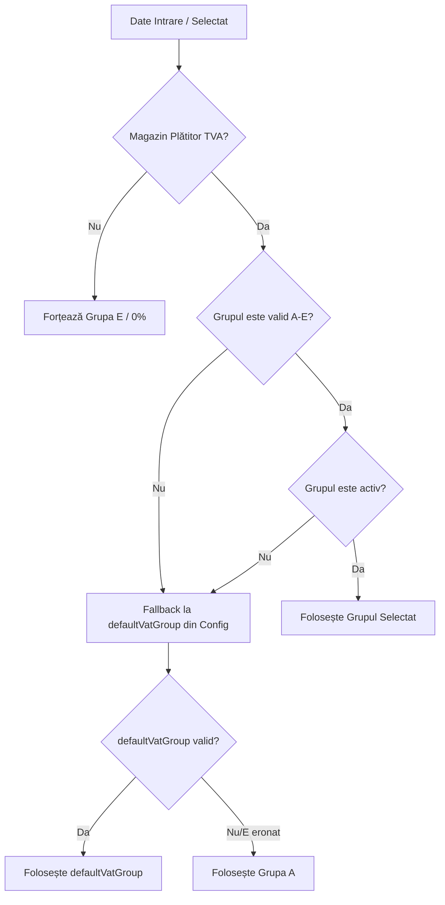

# Raport Hotfix Integrare Frontend TVA Produs (Etapa 6D.4.2.1)

Acest document descrie detaliile tehnice ale remedierii rapide (hotfix) realizate în etapa 6D.4.2.1 pentru alinierea corectă a parsării frontend-ului cu RPC-ul SQL `get_product_vat_config(p_store_id)`.

---

## 1. Modificări Efectuate pe Componente

### A. Serviciul de Produse (`productService.ts`)
* **Parsare Casing Dual**: Am corectat extractorul din `getProductVatConfig(storeId)`. Acesta parsează acum atât proprietățile în format `camelCase` (returnate de RPC-ul database), cât și formatul `snake_case` (legacy/compatibilitate).
  * Câmpuri normalizate: `vatPayer` / `vat_payer`, `defaultVatGroup` / `default_vat_group`, `priceTaxPolicy` / `price_tax_policy`, `vatGroups` / `vat_groups`.
* **Blocare Cota Legacy**: S-a eliminat posibilitatea suprascrierii cotelor de TVA din baza de date. Cotele standard sunt forțate static pe frontend conform legislației:
  * **A** = 21%
  * **B** = 11%
  * **C** = 11%
  * **D** = 0%
  * **E** = 0% (Neplătitor TVA)
* **Funcții Helper Exportate**:
  * `getStandardVatRate(group: VatGroupKey): number` — Returnează cota de TVA statică corespunzătoare grupului.
  * `normalizeVatGroupForStore(input: unknown, config: ProductVatConfig | null): VatGroupKey` — Helper universal care determină grupul corect de TVA în funcție de starea fiscală a magazinului.
* **Securizare Submit (`updateProduct`)**: S-a adăugat validare direct în serviciul de actualizare pentru a asigura că `vatGroup` este valid, iar valoarea legacy `vat_percent` este derivată din cotele standard (evitând injectări de procente invalide).

### B. Modalul de Editare (`ProductEditModal.tsx`)
* În faza de inițializare a stării locale în `useEffect`, am aplicat `normalizeVatGroupForStore` pe `product.vatGroup`.
* La submit (`handleSubmit`), s-a adăugat constrângerea: dacă magazinul este neplătitor de TVA (`vatPayer === false`), grupul forțat la trimitere este `'E'`. Altfel, se normalizează valoarea selectată prin helper.

### C. Selectorul Dropdown (`ProductVatGroupSelector.tsx`)
* Am implementat o logică de fallback vizual: dacă valoarea selectată curent nu este activă sau este invalidă, selectorul face automat fallback la `defaultVatGroup` definit în configurație.
* Ne-am asigurat că dropdown-ul conține grupul de fallback chiar dacă acesta ar fi marcat ca inactiv în mod eronat în baza de date, prevenind crash-urile de rendering.

### D. Tabelul de Produse (`ProductTable.tsx`)
* S-a actualizat afișarea insignei (badge) de TVA în listă:
  * Valorile sunt rulate prin helperul `normalizeVatGroupForStore`.
  * Rata de TVA afișată se calculează exclusiv cu `getStandardVatRate` (derivat direct din grup, eliminând afișările eronate ale ratelor legacy 19/9/5).
  * Stilul vizual respectă grupul normalizat (portocaliu/amber pentru E - Neplătitor, indigo pentru restul).

### E. Modulul Fast Add (`useFastAdd.ts` & `fastAddService.ts`)
* `useFastAdd.ts` folosește acum serviciul centralizat `productService.getProductVatConfig` pentru a obține configurația magazinului.
* La adăugarea rapidă, payload-ul este trimis cu `vatGroup` normalizat și `vatPercent` standardizat.
* În `fastAddService.ts`, datele primite sunt de asemenea validate pentru a stabili corect legătura între `vatGroup` și legacy `vat_percent`.

---

## 2. Conduita de Fallback și Normalizare

* **Pentru Magazine Neplătitoare**: Frontend-ul ignoră orice altă selecție și trimite strict `vatGroup = 'E'` cu `vat_percent = 0`.
* **Pentru Magazine Plătitoare**: Sunt permise doar grupurile active din setul valid `[A, B, C, D]`. În cazul în care configurarea din baza de date are ca implicit `E` (deși magazinul s-a declarat plătitor), se face fallback automat la `A` (standard 21%).

---

## 3. Riscuri Identificate și Atenuare

| Risc Identificat | Nivel Impact | Atenuare Implementată |
| :--- | :---: | :--- |
| **Incompatibilitate Casing RPC** | Ridicat | Extractorul parsează ambele variante (`camelCase` și `snake_case`), asigurând funcționarea fără modificări la nivel de backend. |
| **Cote TVA Perimate / Erroare DB** | Mediu | Pe frontend cotele sunt mapate rigid (A=21, B=11, C=11, D=0, E=0) indiferent de procentele returnate din baza de date. |
| **Modificări Neautorizate POS/Rapoarte** | Critic | Codul a fost izolat strict în modulele `src/features/products` și `src/features/fast-add`. Nicio altă componentă nu a fost modificată direct. |
| **Grupuri Inactive Selectate** | Scăzut | Dropdown-ul ascunde opțiunile inactive și validează automat starea selectată la încărcare. |

---

## 4. Instrucțiuni de Testare E2E Manuală în Staging

Pentru a verifica funcționarea corectă în medii de testare/staging, QA trebuie să ruleze următoarele scenarii:

### Scenariul 1: Magazin Neplătitor de TVA (Simulare)
1. Autentifică-te și selectează un magazin configurat ca **Neplătitor de TVA** (unde RPC-ul `get_product_vat_config` returnează `vatPayer: false`).
2. Navighează la Catalogul de Produse.
3. Deschide modalul de adăugare/editare produs.
4. **Verifică:**
   * Dropdown-ul pentru grupă TVA trebuie să fie dezactivat sau să forțeze afișarea grupei `E (0%)`.
   * La salvare, verifică în Network tab că payload-ul trimite `{ vatGroup: "E" }`.
5. Folosește modulul **Fast Add**:
   * Adaugă un produs rapid.
   * **Verifică:** Produsul nou creat în tabel trebuie să aibă automat insigna `E (0%)`.

### Scenariul 2: Magazin Plătitor de TVA (Simulare)
1. Selectează un magazin configurat ca **Plătitor de TVA** (unde RPC-ul returnează `vatPayer: true`).
2. Deschide modalul de editare al unui produs.
3. **Verifică:**
   * Selectorul dropdown trebuie să îți permită să alegi între grupele active (A, B, C, D).
   * Modifică grupa la `B` (11%). Salvează.
   * **Verifică:** În tabelul de produse, badge-ul trebuie să se actualizeze la `B (11%)`.
4. Deschide din nou modalul de editare pentru același produs.
   * **Verifică:** Selectorul dropdown trebuie să rețină poziția pe `B`.
